Установка и обновления системы Linux. Основы администрирования.

## Part 1. Установка ОС

#### После установки  **Ubuntu 20.04 Server LTS** без графического интерфейса. (Используем программу для виртуализации — VirtualBox по инструкции на сайте *Linuxconfig*)

- Узнать версию Ubuntu, выполнив команду \
`cat /etc/issue` \
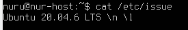
## Part 2. Создание пользователя

 - Создать пользователя, отличного от созданного при установке. Пользователь добавлен в группу `adm`. \
 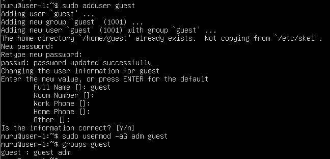  

- Вызов команды для создания пользователя.\
`cat /etc/passwd` \
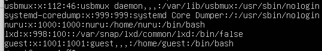

## Part 3. Настройка сети ОС

  1. Задать название машины вида user-1.
  2. Установить временную зону, соответствующую твоему текущему местоположению.  
  3. Вывестти названия сетевых интерфейсов с помощью консольной команды.
  - ### lo
    `Интерфейс lo (loopback) представляет собой виртуальный сетевой интерфейс, используемый для тестирования и обмена данными внутри устройства. Он необходим для проверки сетевых настроек и связи между программами на одном компьютере.`
  4. Используя консольную команду, получи ip адрес устройства, на котором ты работаешь, от DHCP-сервера. 
  - ### DHCP
    `Для работы по сети любому устройству требуется IP-адрес. В протоколе IPv4 это числовой идентификатор, состоящий из 4 разрядов, каждый из которых отделяется точкой, без него устройство не может быть определено в сетевой инфраструктуре. 
   Прикладной протокол DHCP выполняет всю работу по подбору сетевых настроек автоматически, без необходимости присваивать вручную каждому устройству свой IP-адрес. Это очень упрощает работу системного администратора в случае расширения сети.`

    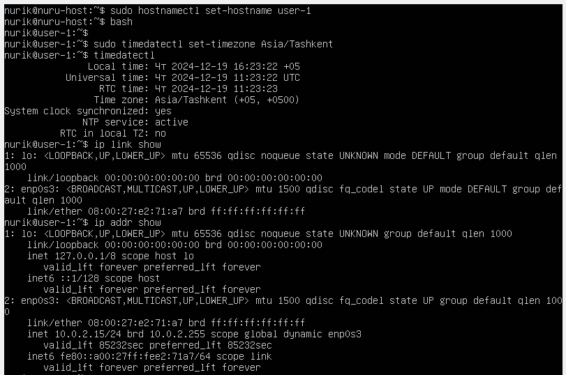

 5.  Определить и вывести на экран внешний ip-адрес шлюза (ip) и внутренний IP-адрес шлюза, он же ip-адрес по умолчанию (gw).  
 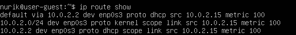
 6. Задать статичные (заданные вручную, а не полученные от DHCP-сервера) настройки ip, gw, dns (используй публичный DNS-серверы, например 1.1.1.1 или 8.8.8.8).  
 - `sudo nano /etc/netplan/01-installer-config.yaml` \
 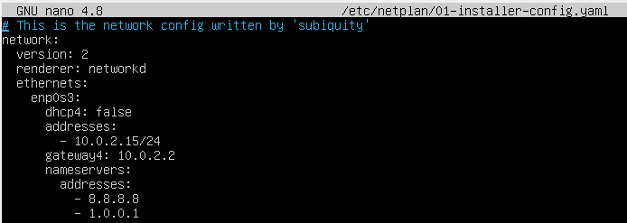 
 
 - `sudo netplan apply`

 7. Перезагрузи виртуальную машину. Убедись, что статичные сетевые настройки (ip, gw, dns) соответствуют заданным в предыдущем пункте.  
 - `sudo reboot`

 - Проверка на пинг \
 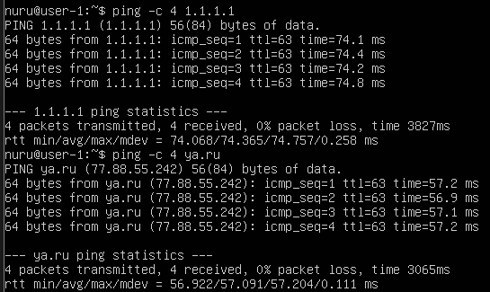

## Part 4. Обновление ОС
 - Обновлени системных пакетов.  
 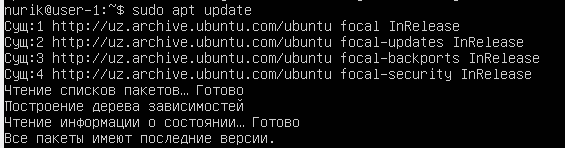

## Part 5. Использование команды **sudo**

 ##### Разрешить пользователю, созданному в [Part 2](#part-2-создание-пользователя),выполнять команду sudo.
- `sudo usermod -aG sudo guest `
- `sudo` предоставляет полный доступ к ситеме с правами      администратора \

 - Поменять hostname ОС от имени пользователя, созданного в пункте [Part 2](#part-2-создание-пользователя) (используя sudo). \
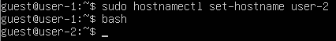
## Part 6. Установка и настройка службы времени

##### Настроить службу автоматической синхронизации времени.  
- 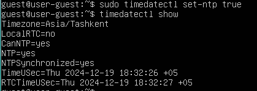
## Part 7. Установка и использование текстовых редакторов 

##### Установить текстовые редакторы **VIM** (+ любые два по желанию **NANO**, **MCEDIT**, **JOE** и т. д.)  
- `sudo apt install vim nano micro`

##### Используя каждый из трех выбранных редакторов, создать файл *test_X.txt*, где X — название редактора, в котором создан файл. Написать в нём свой никнейм, закрыть файл с сохранением изменений.  
- `vim test_vim.txt` \
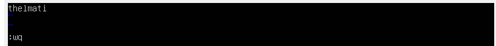 \
  `esc :wq`

- `nano test_nano.txt` \
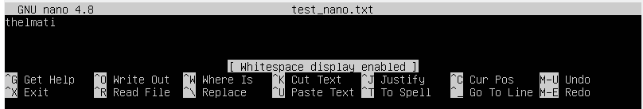 \
 `ctrl +s ctrl +x`

- `micro test_micro.txt` \
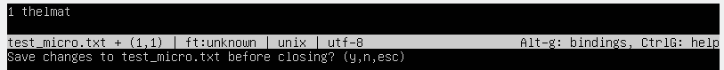 \
`ctrl + q`

##### Используя каждый из трех выбранных редакторов, открой файл на редактирование, отредактируй файл, заменив никнейм на строку «21 School 21», закрой файл без сохранения изменений. 
 
- `vim: esc , :q!` \
 

- `nano: ctrl+x` \
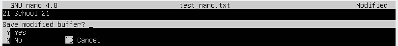 

- `micro: ctrl+q` \
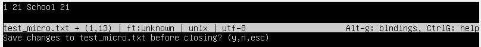

##### Используя каждый из трех выбранных редакторов, отредактируй файл ещё раз (по аналогии с предыдущим пунктом), а затем освой функции поиска по содержимому файла (слово) и замены слова на любое другое.
 - `vim search: esc ` \
  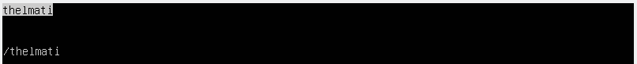 \
 `vim replace`\
 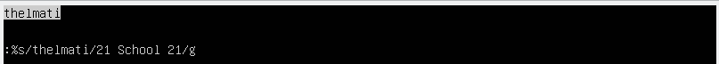

 - `nano serach: ctrl + w` \
 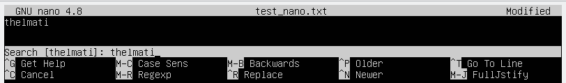 \
 `nano replace: ctrl + w ctrl + r` \
 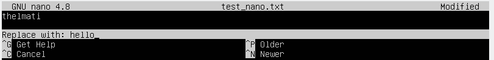

 - `micro search: ctrl + f` \
 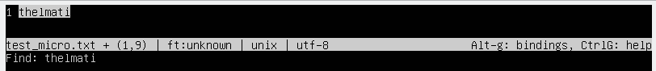 \
  `micro replace: ctrl + e` \
 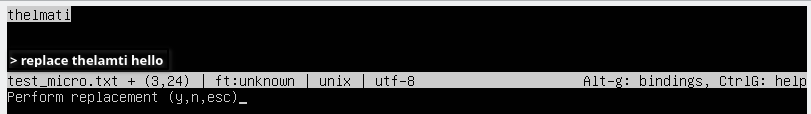 
 

## Part 8. Установка и базовая настройка сервиса **SSHD**

##### Установить службу SSHd.  
- `sudo apt insatll openssh-server`
##### Добавь автостарт службы при загрузке системы.  
- `sudo systemctl enable ssh`

##### Перенастрой службу SSHd на порт 2022.  
- `sudo nano /etc/ssh/sshd_config`
##### Используя команду ps, покажи наличие процесса sshd. Для этого к команде нужно подобрать ключи.
- `sudo ps aux | grep sshd`
##### Перезагрузи систему.
- `sudo reboot`

- Вывод команды netstat -tan должен содержать  \
- `netstat -tan` \
  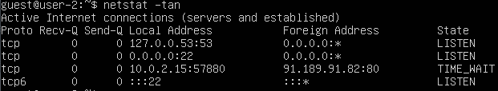
  - t — выводит только TCP-соединения
  - a — отображает все соединения и сокеты
  - n — выводит адреса и порты в числовом виде

    -     tcp — тип соединения (TCP). 
  1. 0 — количество полученных данных в очереди.
  2. 0 — количество отправленных данных в очереди.
  3. 0.0.0.0:2022 — IP-адрес и порт, на которых сервис слушает (0.0.0.0 означает, что служба слушает на всех доступных интерфейсах).
  4. 0.0.0.0: — это адреса хоста, с которых можно подключиться (обозначает, что разрешено подключение с любого хоста).
  5. LISTEN — состояние сокета, которое означает, что служба ожидает подключения.

## Part 9. Установка и использование утилит **top**, **htop**

##### Установи и запусти утилиты top и htop. 

- 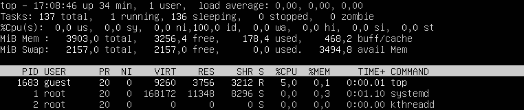
- 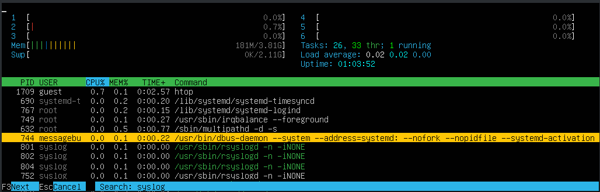
  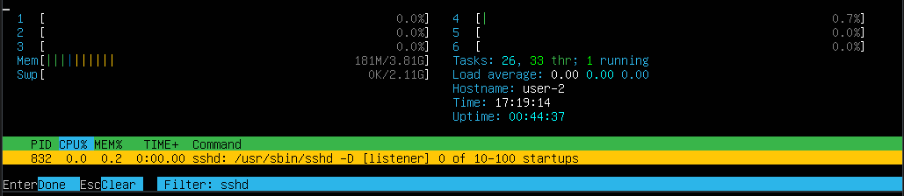 

## Part 10. Использование утилиты **fdisk**

##### Запусти команду fdisk -l.

- VBOX HARDDISK, 26843545600 bytes, 5248800 sectors, 2,1 G

## Part 11. Использование утилиты **df** 

##### Запусти команду df.  
- Mounted (/):
  - bloks: 11 218 472
  - used: 5 046 816
  - avail: 5 579 992
  - use %: 48%
- 1K-blocks.  

##### Запусти команду df -Th.
- Mounted(/):
    - size: 11 G
    - used: 4.9 G
    - avail: 5.9 G
    - use %: 48%
- ext4

## Part 12. Использование утилиты **du**

##### Запусти команду du.
- 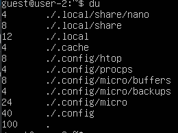 

##### Выведи размер папок /home, /var, /var/log (в байтах, в человекочитаемом виде).
- `/home` \
 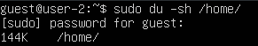
- `/var` \
 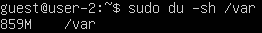
- `/var/log` \
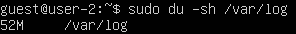
##### Выведи размер всего содержимого в /var/log (не общее, а каждого вложенного элемента, используя *).
 - 

## Part 13. Установка и использование утилиты **ncdu**

##### Установи утилиту ncdu.
- `sduo apt install ncdu`
##### Выведи размер папок /home, /var, /var/log.q
- `/home: 140,0 KiB`
- `/var: 853,8 MiB`
- `/var/log/*: 51,6 MiB`
  - \
   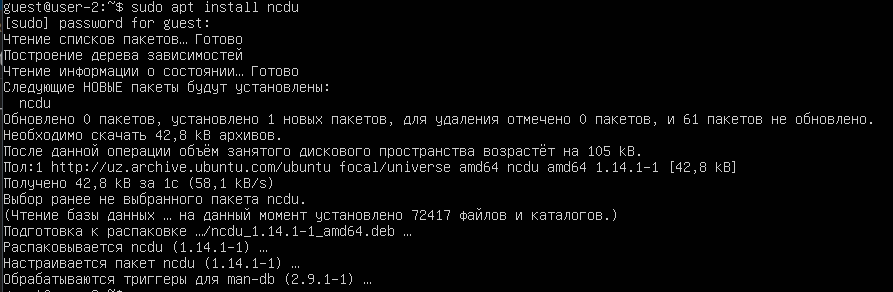 

    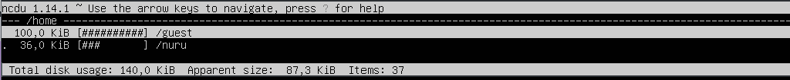

    

    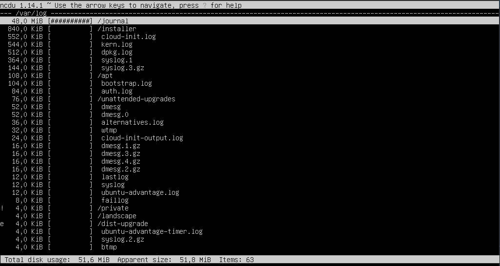
## Part 14. Работа с системными журналами

##### Открой для просмотра:
##### 1. /var/log/dmesg
##### 2. /var/log/syslog
##### 3. /var/log/auth.log  
 
-  \
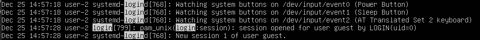

- 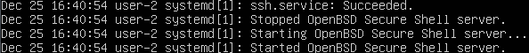

## Part 15. Использование планировщика заданий **CRON**

##### Используя планировщик заданий, запусти команду uptime через каждые 2 минуты.
- 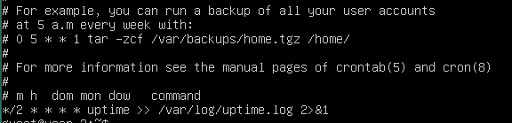

##### Удали все задания из планировщика заданий.
- 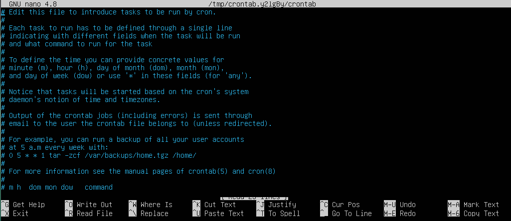