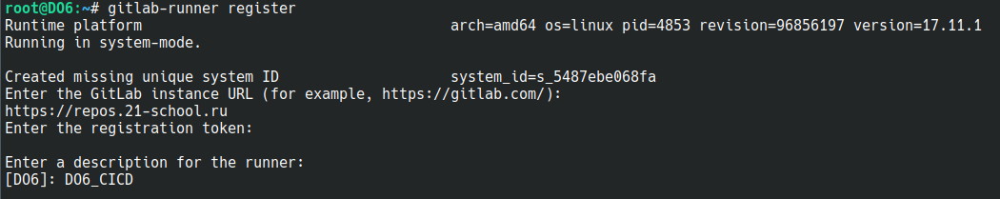
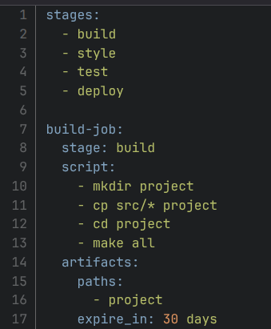
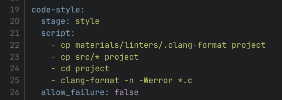
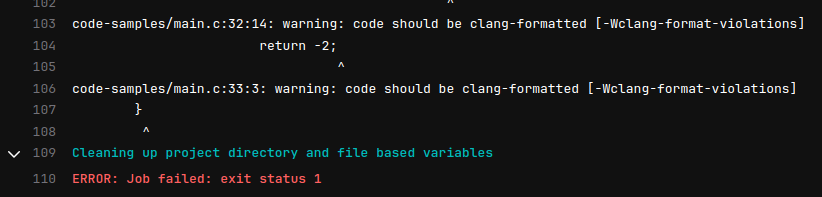
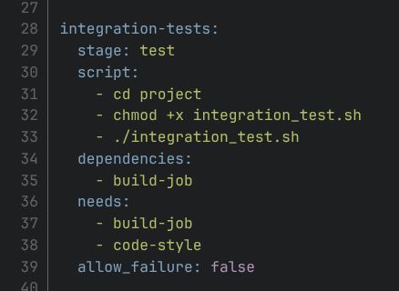
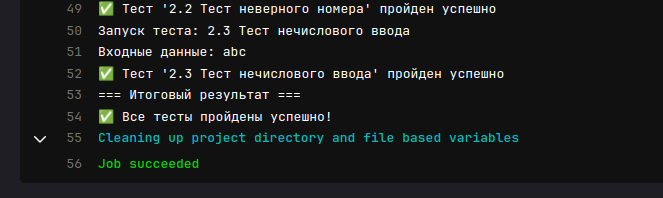
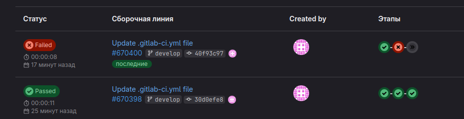
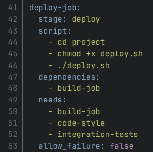
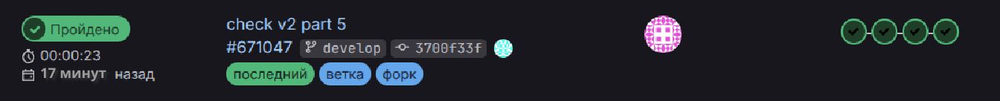

# Basic CI/CD

## Contents

1. [Chapter I](#chapter-i) \
  1.1. [Настройка gitlab-runner](#part-1-настройка-gitlab-runner)  \
  1.2. [Сборка](#part-2-сборка)  \
  1.3. [Тест кодстайла](#part-3-тест-кодстайла)   \
  1.4. [Интеграционные тесты](#part-4-интеграционные-тесты)  \
  1.5. [Этап деплоя](#part-5-этап-деплоя)  \
  1.6. [Дополнительно. Уведомления](#part-6-дополнительно-уведомления)

## Chapter I

### Part 1. Настройка **gitlab-runner**

##### 1) Подними виртуальную машину *Ubuntu Server 22.04 LTS*.
##### 2) Скачай и установи на виртуальную машину **gitlab-runner**.

##### Запусти **gitlab-runner** и зарегистрируй его для использования в текущем проекте (*DO6_CICD*).

### Part 2. Сборка

1) Напиши этап для **CI** по сборке приложения из папки code-samples *DO*. 
    - В файле _.gitlab-ci.yml_ добавь этап запуска сборки через мейк файл из папки code-samples.
    - Файлы, полученные после сборки (артефакты), сохрани в произвольную директорию со сроком хранения 30 дней.

### Part 3. Тест кодстайла

#### Напиши этап для **CI**, который запускает скрипт кодстайла (*clang-format*).
##### Если кодстайл не прошел, то «зафейли» пайплайн.

##### В пайплайне отобрази вывод утилиты *clang-format*.

### Part 4. Интеграционные тесты

#### Напиши этап для **CI**, который запустит интеграционные тесты.

##### Для проекта из папки code-samples напиши интеграционные тесты самостоятельно. Тесты могут быть написаны на любом языке (c, bash, python и т.д.) и должны вызывать собранное приложение для проверки его работоспособности на разных случаях.
##### Запусти этот этап автоматически только при условии, если сборка и тест кодстайла прошли успешно.

##### Если тесты не прошли, то «зафейли» пайплайн.
##### В пайплайне отобрази вывод, что интеграционные тесты успешно прошли / провалились.

### Part 5. Этап деплоя

**== Задание ==**

##### Подними вторую виртуальную машину *Ubuntu Server 22.04 LTS*.

#### Напиши этап для **CD**, который «разворачивает» проект на другой виртуальной машине.

##### Запусти этот этап вручную при условии, что все предыдущие этапы прошли успешно.

##### Напиши bash-скрипт, который при помощи **ssh** и **scp** копирует файлы, полученные после сборки (артефакты), в директорию */usr/local/bin* второй виртуальной машины.

##### В файле _.gitlab-ci.yml_ добавь этап запуска написанного скрипта.

##### В случае ошибки «зафейли» пайплайн.

##### Сохрани дампы образов виртуальных машин.
**P.S. Ни в коем случае не сохраняй дампы в гит!**